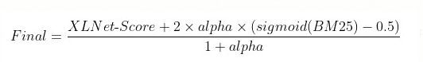

# Spotify Challenge Task-I


## Possible Approaches:
- Approach (1): Regression Scores
	 - (1): XLNet for Regression (query + descriptive query ---> 2 minute segments) 
	- (2): alpha idea (?): Use the following formula for the final score:

	

- Approach (2): Contextualised Embeddings
	- (1): XLNet for contextualised embeddings for every token of the query and the document (separately)
	- (2): Follow the "Simple Contextualization for Re-ranking" paper (uses similarity matrix and kernel pooling)

- Steps after completing Approaches (1) and (2):
	- (1): Compare results of Approaches (1) and (2) with fixed hyperparameters (same number of layers unfrozen, and same Learning Rate)
	- (2): Try the concatenation approach (take embeddings from last few transformer layers and concatenate them)
	- (3): Generate alternate queries by using synonyms (Query Expansion)
	- (4): Save doc embeddings
	- (5): Try other models (TransformerXL)
	- (6): Ensemble Model

- Inference Steps:
	- (1): BM25+RM3 (query title ---> full episodes)
	- (2): Neural re-ranking using BM25 (top k docs) first and then XLNet (either Approach (1) or Approach (2))
	
## Colab Link: 
- https://colab.research.google.com/drive/1TfS2uva7uSI8tstFDacYDC2wnRaCGZ-G?usp=sharing
- [XLNet Domain Adaptation] https://colab.research.google.com/drive/19qbPNrtjeH6M57SzlI-nzAA8YWZPOQcp?usp=sharing
- [XLNet Regression] https://colab.research.google.com/drive/1MpABumNvq0aa52ZKAeEJ2L6V2lHA_BEr?usp=sharing
- [XLNet Contextual Approach] https://colab.research.google.com/drive/12irh9NmgJIz1GRjuz0d2VTYHMUMwMBvm?usp=sharing


- [BART Summarisation] https://colab.research.google.com/drive/1fSchPjNpO7eLfHVmUHIu0vhVT_7nQpcX?usp=sharing
- [XLNet Summarisation] https://colab.research.google.com/drive/1EQZHcpitMly3xw6vA6PsKIDT-v8xwUmX?usp=sharing


## Dataset Link: 
https://drive.google.com/drive/folders/1AzQKdgQfHE6NXE7y1fdeAHJjGMkCI2ZV?usp=sharing

## For Domain Adaptation, use the following command:
```
cd domain_adaptation/xlnet
python run_language_modeling.py \
    --output_dir=output \
    --model_name_or_path=xlnet-base-cased \
    --do_train \
    --train_data_file=train.pkl \
    --do_eval \
    --eval_data_file=val.pkl \
```

## For XLNet Regression, use the following command:
```
python transformers_only/xlnet/train.py \
	--train_data_path transformers_only/xlnet/train.pkl \
	--batch_size 4 \
	--epochs 5
```

## For XLNet Contextual Approach, use the following command:
Build allennlp from source.
```
python train.py \
	--train_data_path train.pkl \
	--batch_size 4
```
## References

(Important links in bold)

#### Regression
- **Simple Applications of BERT for Ad Hoc Document Retrieval: https://arxiv.org/abs/1903.10972**
- **Applying BERT to Document Retrieval with Birch: https://www.aclweb.org/anthology/D19-3004.pdf**
- A Comparative Study of Methods for Estimating Query Language Models with Pseudo Feedback: https://dl.acm.org/doi/pdf/10.1145/1645953.1646259
- Transformer Based Language Models for Similar Text Retrieval and Ranking: https://arxiv.org/abs/2005.04588
- Useful links for the ad-hoc retrieval problem: https://paperswithcode.com/sota/ad-hoc-information-retrieval-on-trec-robust04
- **The Neural Hype and Comparisons Against Weak Baselines(Comparison of basic IR methods (like BM25/QL/RM3, etc.)): http://sigir.org/wp-content/uploads/2019/01/p040.pdf**
- **Leaderboard for text classification models: https://paperswithcode.com/task/text-classification**
- **UDA for Consistency Training: https://arxiv.org/abs/1904.12848**
- AutoAugment-Learning Augmentation Strategies from Data (not so important right now): https://arxiv.org/abs/1805.09501 

#### Contextualised Embeddings
- CEDR: Contextualized Embeddings for Document Ranking: https://arxiv.org/pdf/1904.07094v3.pdf
- **End-to-End Neural Ad-hoc Ranking with Kernel Pooling: https://arxiv.org/pdf/1706.06613.pdf**
- **Simple Contextualization for Re-ranking: https://arxiv.org/pdf/1912.01385v1.pdf**